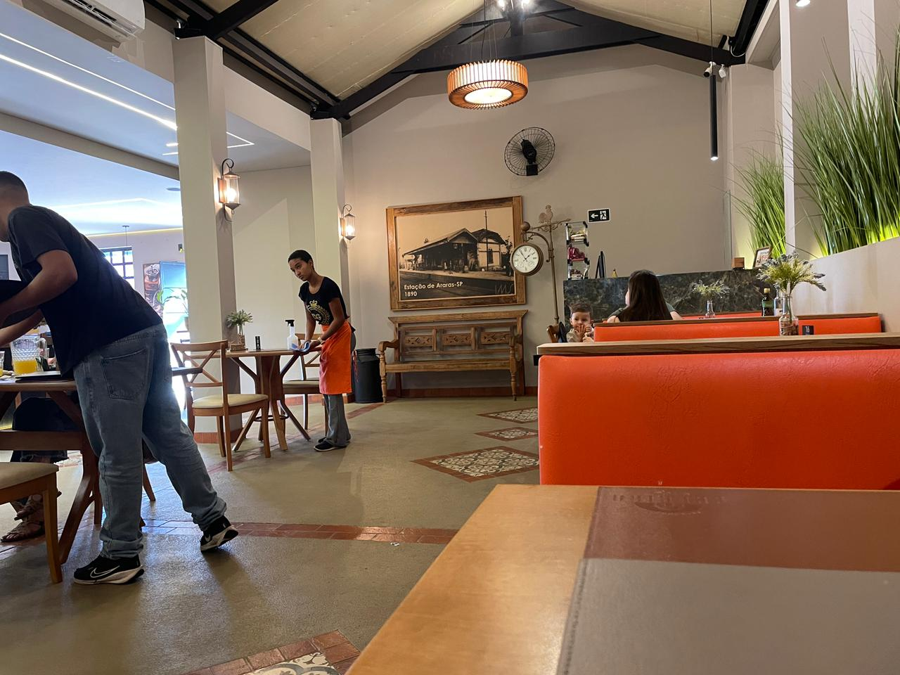
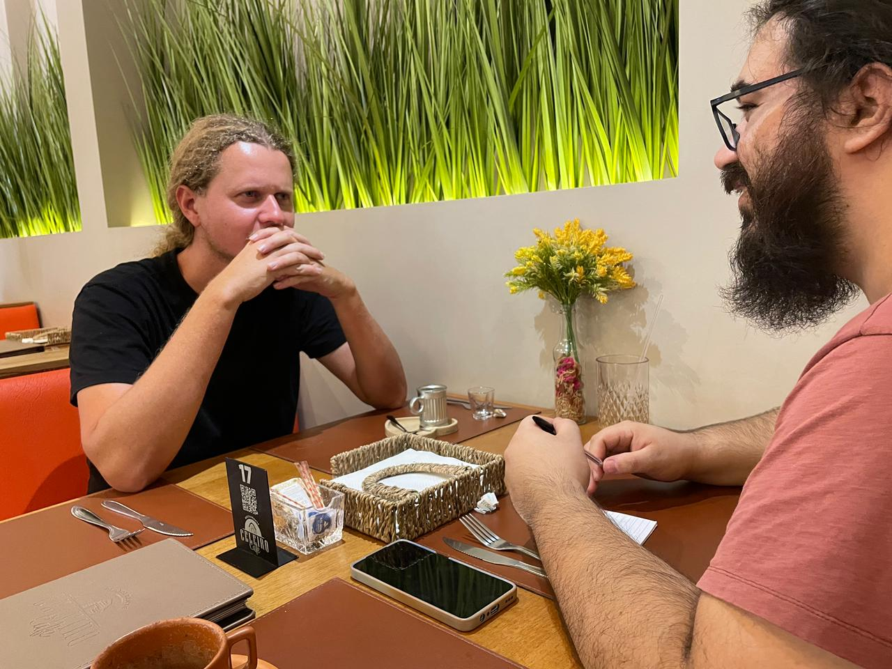
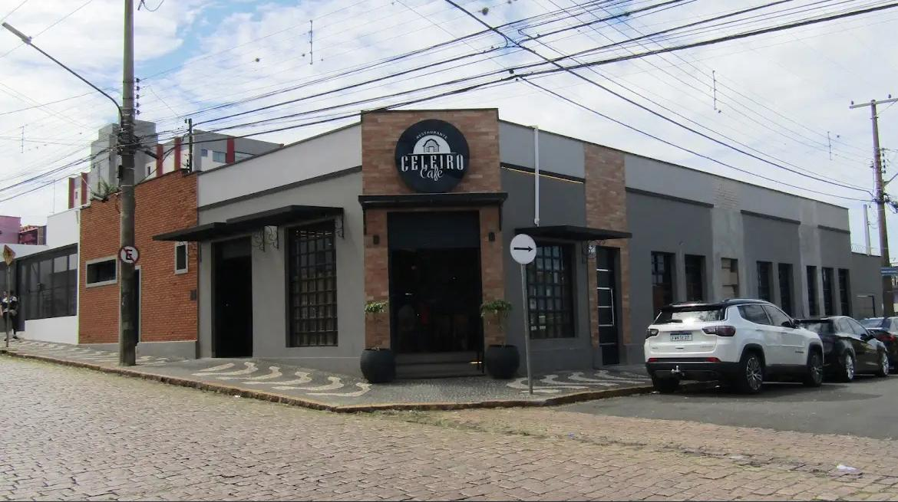

# 📄 Documentação

## 📅 Reunião

Marcamos uma reunião com o cliente no dia **14/05/2025 (quarta-feira)**, agendada para o dia **17/05/2025 (sábado)**, às **14h**, no estabelecimento **Celeiro Café**.

  
  
  

---

### 🧑‍💼 Participantes

Do grupo, compareceram:
- **Michael Freitas**
- **Rodolfo Mendes**

O entrevistado foi **Lucas Gabriel Paes**, proprietário da **LM Informática**.

---

### 📋 Assuntos discutidos

Durante a conversa, abordamos os seguintes tópicos:
- A proposta do sistema;
- O tipo de software ideal para o cliente;
- Design desejado;
- Como o cliente realiza atualmente seus anúncios;
- A forma como organiza seus processos internos.

Com **autorização e consentimento do cliente**, concordamos em iniciar o projeto utilizando o nome e a marca **LM Informática**.
